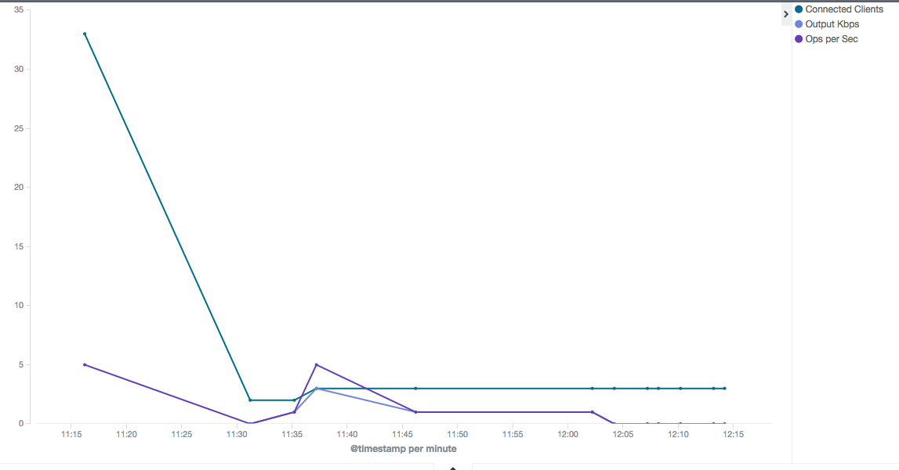

[](https://img.shields.io/badge/license-BSD--3--Clause-blue.svg)
[](https://goreportcard.com/report/github.com/globocom/redis-healthy)
[](https://travis-ci.org/globocom/redis-healthy)

# redis-healthy

It retrieves metrics periodically from [Redis](http://redis.io) (or sentinel) (such as [`latency`](http://redis.io/topics/latency), `connected_clients`, `instantaneous_ops_per_sec` and [others](http://redis.io/commands/INFO)) and send them to [Logstash](https://www.elastic.co/products/logstash).

## Plotting the metrics with Grafana



## Tests

```bash
make test
```

## Metrics

```javascript
{
   client_longest_output_list: 15,
   instantaneous_input_kbps: 0,
   sync_partial_err: 0,
   latency: 361,
   connected_clients: 398,
   blocked_clients: 0,
   keyspace_hits: 201980,
   client: 'app-redis',
   instantaneous_ops_per_sec: 1092,
   instantaneous_output_kbps: 504,
   sync_full: 0,
   keyspace_misses: 1093,
   mem_fragmentation_ratio: 0,
   rejected_connections: 0,
   sync_partial_ok: 0
}
```

## Options

| Variable | Mandatory | Description |
|:---------|:----------|:------------|
| PROJECT | Y | An identifier for the metrics.<br>It'll be send as `"client": PROJECT + "-redis"` |
| PING_FREQUENCY | | Frequency in seconds that the metrics are fetched.<br>**Default:** `10` |
| REDIS_HOST | Y | Redis host with port.<br>If you're using redis sentinel, then REDIS_HOST will host the sentinel hosts separated by commas ("host:port,host:port") |
| REDIS_PWD | | Redis password.<br>**Default:** `""` |
| REDIS_SENTINEL | | Whether you're using sentinel or not.<br>**Default:** `""` |
| REDIS_MASTER_NAME | | Redis sentinel master name.<br>**Default:** `""` |
| REDIS_LATENCY_THRESHOLD | | Redis latency threshold in ms.<br>When any command take longer than the threshold, then it sends data about latency. After `PING_FREQUENCY` has passed, it sends 0.<br>**Default:** `""` |
| REDIS_METRICS_TO_WATCH | | The fields you want to keep track from the output of the command "info".<br>**Default:** `"client_longest_output_list,connected_clients,blocked_clients,rejected_connections,instantaneous_input_kbps,instantaneous_output_kbps,instantaneous_ops_per_sec,keyspace_hits,keyspace_misses,mem_fragmentation_ratio,sync_full,sync_partial_ok,sync_partial_err"` |
| LOGSTASH_HOST | Y | Logstash host |
| LOGSTASH_PORT | Y | Logstash port |
| LOGSTASH_PROTOCOL | | The transport protocol used by logstash.<br>**Default:** `"udp"` |

## Usage

```bash
REDIS_LATENCY_THRESHOLD="250" REDIS_HOST="localhost:6379" LOGSTASH_HOST="logstash.mine" LOGSTASH_PORT="8515" PROJECT="myapp" go run main.go
```
